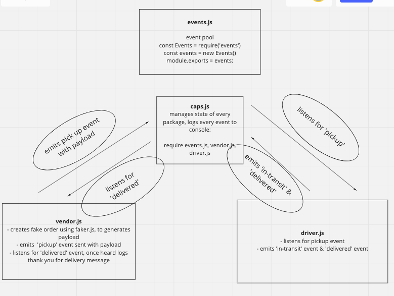

# Lab11: CAPS
## Author: Taylor Thornton with refactoring based on feedback from grading TA. 

This is a TCP/UDP model of an event driven programming application.  There are three files within this API which all "talk" to each other and "listen" for events to respond to which can include emitting an event of their own. 

## Setup
- In your local environment declare PORT and STORE_NAME in a .env file
- npm init
- Install dependencies: faker, jest, expressm dotenv

## Returns Object (sample)
`{
  storeName: 'lampstore',
  address: '322 Chaim Unions North Nikoton, Hawaii  64678',
  customerName: 'White, Gianni',
  orderId: 63887
}
DRIVER: picked up 63887
DRIVER: delivered 63887
VENDOR: thank you for delivery 63887`

## Tests(in progress)
- To run unit test: npm run test `'<test file name>'`

## UML 

## Assistance:
- TA -  setTimeout() v. setInterval()
- Grading TA - start to 'caps.js' from 'index.js'